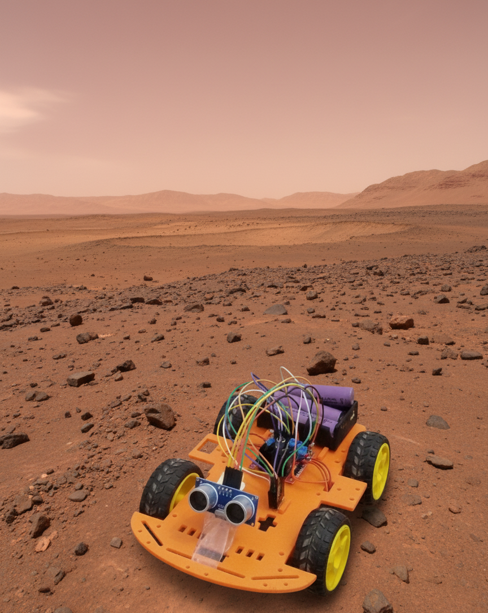

# 🤖 AI Curiosity Rover

An ESP32-powered autonomous rover with **AI-assisted hand gesture control** using OpenCV and Mediapipe.

---

## 🚀 Features
- ESP32 microcontroller + L298N motor driver  
- Wi-Fi UDP communication with Python  
- Gesture control using webcam  
- Real-time FPS & connection status overlay  
- Safe stop if hand not detected  
- Speed control via pinch gesture  

---

## 🧩 Project Structure

---

## ⚙️ Requirements

### 🧠 ESP32 Side
- Arduino IDE **v2.0+**
- ESP32 board package installed  
  *(in Arduino IDE → Tools → Board → Boards Manager → search “ESP32” by Espressif)*
- L298N Motor Driver + Ultrasonic Sensor
- Power Source: 6–8V Battery Pack

---

### 💻 Python Side (for Gesture Control)
Make sure you have **Python 3.8+** installed.

Then install the required libraries by running this command in your terminal:

```bash
pip install opencv-python mediapipe numpy

## 🤖 AI Curiosity Rover



